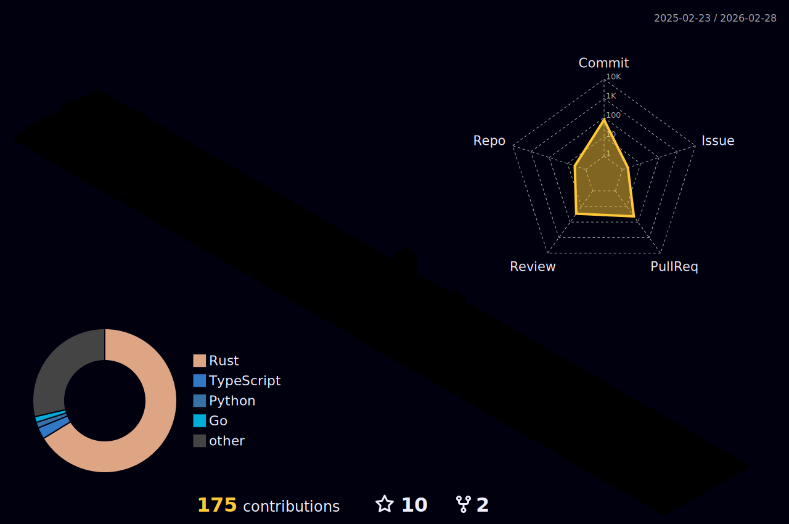

# Hi there, I'm Vinh 🧑‍💻

```rust
fn main() {
    let vinh = Vinh::builder()
        .researcher()
        .software_engineer()
        .from("Hanoi, Vietnam")
        .age(Duration::from_years(23))
        .love(["Tech 💻", "Gym 🏋️", "Climbing 🧗"])
        .stack(["Rust 🦀", "Blockchain 📦", "Cryptography 🔐"])
        .dream(todo!("See, feel and explore everything 🔥"))
        .contact("linkedin.com/in/vinhtc27")
        .build();
}
```

## Contributions:


